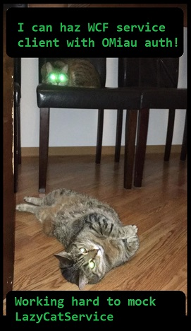

# WCF client with OMiau authentification
Simple migration of WFC clients to support OAuth2 or whatever authentification,
including not yet standartized OMiau authentification.

Use for fast porting of legacy WCF clients to support legacy WCF services that just
added OAuth2 (or whatever authorization).
This example shows how to add support for OMiau authentification, but everything is
the same for OAuth2.

_If you can do OMiau you will better understand OAuth2._

### LazyCatWcfService.csproj
Start LazyCatWcfService project, the WCF service will be served on IIS Express at
http://localhost:41193/LazyCatService.svc

### LazyCatConsole.csproj
Contains all the guts.
The project contains xUnit tests, and simple console test-run for common client usage scenarios.
2 levels of applying OMiau/OAuth authorization are shown and tested here.

__LazyCatServiceClient / LazyCatClientFactory.CreateAnonymousAuthClient()__

Generated standard WCF client (via Add Service Reference in Visual Studio,
using Task-based async operations option). Anonymous authorization.

__LazyCatServiceOMiauManualClient / LazyCatClientFactory.CreateOMiauAuthClient()__

Manually handcrafted WCF client with OMiau authentification. Supports "source code" 
compatibility level with LazyCatServiceClient: service methods are overriden
with new operator, OMiau/OAuth2 headers are set there, inside new service methods.

This is level 1: use it if you have few WCF services, few methods and the service
methods are quite stable and will not change in future.

__ILazyCatServiceSlimClient / LazyCatClientFactory.CreateOMiauAuthSlimClient()__

"Slim" WCF service client, consists only of [service interface + IDisposable] interface to
the outside world. The implementation of service methods is hooked by interceptor
(with help of dynamic code generation), OMiau/OAuth2 headers are applied inside the hooks.

This is level 2: use it if you have many WCF services, many methods or the service methods
may change in future.

### LazyCatWinForm.csproj
Uses service clients to replay common client usage scenarios to check that
we don't block WinForms UI with async operations.
